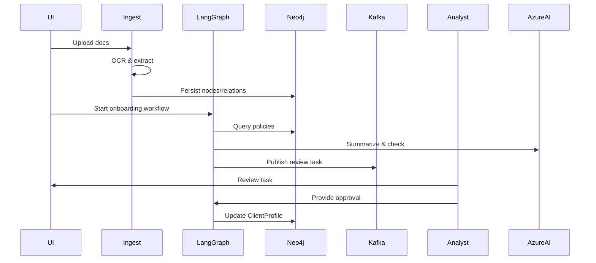
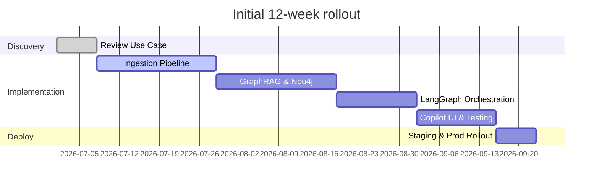

# Enterprise Agentic AI Platform — Requirements

Derived from `Use_case.md` describing the Barclays Investment Banking Agentic AI platform.

## 1. Overview
- Purpose: Capture complete functional and non-functional requirements for the Agentic AI platform that orchestrates specialized LLM agents (compliance, client onboarding, knowledge retrieval) using LangGraph, GraphRAG on Neo4j, Azure AI, Kubernetes, Docker, and Kafka.
- Primary objectives:
  - Automate regulatory compliance checks and guidance.
  - Streamline client onboarding via automated document analysis and profiling.
  - Provide Copilot-style natural-language access to internal policy corpus.

## 2. Stakeholders
- Platform Owner: Investment Banking AI Platform Lead
- Users: Compliance Analysts, Onboarding Officers, Relationship Managers, DevOps
- Security: Information Security / GRC
- Infra: Cloud Platform / Kubernetes Team
## 3. Assumptions
- Azure cloud tooling (AKS, Azure AI, Azure Monitor) is available.
- Neo4j cluster available for knowledge graph storage.
- Apache Kafka available for async messaging.
- LLMs accessible via Azure OpenAI Service (or equivalent).

## 4. Scope
- In-scope: Design, implementation, and deployment of agent orchestration, GraphRAG retrieval, tool-calling framework, Copilot UI, security controls, monitoring.
- Out-of-scope: Third-party vendor integrations not listed, non-Azure cloud providers (unless requested), banking core systems beyond documented interfaces.

## 5. Functional Requirements (detailed, step-by-step)

5.1 Compliance Agent
- FR-C-1: Ingest regulatory documents and internal policies into the knowledge graph (Neo4j).
  - Step 1: Acquire document PDF or text via connector.
  - Step 2: Run OCR & text extraction pipeline.
  - Step 3: Extract entities and relations (regulation id, section, obligations, roles).
  - Step 4: Map entities into Neo4j nodes and relationships.
 - FR-C-2: Evaluate a client or transaction against compliance rules (expanded decision logic).
  - Step 1: Receive request with context (client id, transaction details, user_id, request_id).
  - Step 2: Validate and enrich context: canonicalize client id, normalize currencies, fetch recent transactions.
  - Step 3: Retrieve relevant graph context via GraphRAG traversal using a bounded-depth query (configurable depth, default 3 hops).
  - Step 4: Construct structured LLM prompt that includes:
    - (a) Retrieval snippets with provenance (node ids, scores, excerpts).
    - (b) Structured facts about the client/transaction.
    - (c) Decision template describing required outputs and rationale fields.
  - Step 5: Invoke LLM with tool-calling enabled; allow LLM to call specific evaluators (e.g., rule-evaluator) via LangGraph.
  - Step 6: Post-process LLM output into a machine-readable decision record with these fields:
    - decision: enum {pass, warn, fail}
    - confidence: float (0.0-1.0)
    - rule_hits: [ {rule_id, rule_title, match_score, evidence_ids} ]
    - rationale: human-readable explanation
    - provenance: [ {source_id, source_type, excerpt, rank} ]
  - Step 7: Apply automated thresholds:
    - If confidence >= 0.85 and decision == pass -> auto-approve.
    - If 0.6 <= confidence < 0.85 or decision == warn -> create review task and publish to Kafka review topic.
    - If confidence < 0.6 or decision == fail -> require human review by compliance analyst.
  - Step 8: Persist the decision record, tool-call traces, and all retrieved provenance into Neo4j and audit logs for later replay and inspection.
  - Step 9: Return API response containing decision code, confidence, short rationale, and links to provenance (document ids / Neo4j node ids).


5.2 Onboarding Agent
- FR-O-1: Document analysis and profile creation.
  - Step 1: Intake KYC documents via secure upload.
  - Step 2: Parse forms, extract PII fields and supporting evidence.
  - Step 3: Create or update `ClientProfile` node in Neo4j with evidence links.
- FR-O-2: Automated checklist & workflow orchestration.
  - Step 1: Generate a checklist tailored by client type from policy graph.
  - Step 2: Assign tasks to human reviewers when automated confidence < threshold.

5.3 Knowledge Retrieval / Copilot
- FR-K-1: Natural language Q&A over internal policy corpus.
  - Step 1: Accept analyst query via Copilot UI.
  - Step 2: Retrieve supporting passages via Azure AI Search + GraphRAG.
  - Step 3: Compose answer with citations and provenance links.
  - Step 4: Allow follow-up queries preserving conversational context.

5.4 Tool-calling Framework (LangGraph integration)
- FR-T-1: Provide structured tool invocation API allowing agents to call specialized tools (e.g., document-analyzer, rule-evaluator, kafka-publish).
  - Step 1: Define tool schema (name, inputs, outputs, error codes).
  - Step 2: LangGraph orchestrator routes calls and aggregates responses.
  - Step 3: Persist tool call traces for audit.

5.5 Messaging & Async Coordination
- FR-M-1: Use Kafka topics for agent-to-agent asynchronous messages.
  - Step 1: Define topics and schemas (Avro/JSON Schema).
  - Step 2: Ensure exactly-once or at-least-once semantics as required.

## 6. Data Model (tables)

- Nodes and key properties:

| Node Type | Key Properties | Description |
|---|---|---|
| Regulation | id, title, effective_date, text_snippet | Regulatory items parsed from documents |
| Policy | id, department, summary, link | Bank internal policy documents |
| ClientProfile | client_id, name, risk_score, country, pII_refs | Onboarding & profile data |
| Document | doc_id, source, upload_date, sha256 | Raw documents and metadata |
| Evidence | evidence_id, doc_id, page, excerpt | Extracted evidence supporting facts |

- Relationships (examples):

| Relationship | From | To | Description |
|---|---|---|---|
| APPLIES_TO | Regulation | ClientProfile | Which regulations apply to a client |
| CITED_IN | Evidence | Policy | Evidence excerpts cited in policy |
| CREATED_FROM | ClientProfile | Document | Doc used to create profile |

## 7. API & Integration Contracts (tables)

| API | Method | Payload (summary) | Auth | Success Criteria |
|---|---:|---|---|---|
| /api/agents/inspect | POST | context: {clientId, txData} | OAuth2 (Azure AD) | Returns decision + rationale |
| /api/documents/upload | POST | file (multipart), meta | OAuth2 | Returns doc_id and ingestion status |
| /api/copilot/query | POST | {query, sessionId} | OAuth2 | Returns answer, citations, sources |

## 8. Non-Functional Requirements

- Security
  - NFR-S-1: All APIs require Azure AD OAuth2 authentication with RBAC.
  - NFR-S-2: Data at rest encrypted (Azure Key Vault / disk encryption); PII encrypted with field-level keys.
  - NFR-S-3: Audit logging of all LLM calls, tool invocations, and decisions for compliance.

- Performance & Scalability
  - NFR-P-1: System must scale to 100 concurrent analyst sessions with <2s retrieval latency for GraphRAG fetches under normal load.
  - NFR-P-2: Kafka must handle peak throughput of messages (estimate configurable).

- Availability
  - NFR-A-1: Platform SLA 99.9% for core services (ingestion, retrieval, orchestration).

- Observability
  - NFR-O-1: Integrate Azure Monitor and AppInsights for traces, metrics, and alerts.
  - NFR-O-2: Enable structured tracing across LangGraph orchestrations and Kafka flows.

## 9. Security Controls (detailed)
- Data classification and masking for PII in UIs. UI components must support role-based field masking and redaction at render time based on data classification labels stored with each data item.
- Request-level provenance: include `request_id`, `user_id`, `correlation_id`, `session_id`, and `workflow_step` metadata for each LLM/tool invocation.
- Key Management: Use Azure Key Vault to store all encryption keys and secrets; implement key rotation (90 days) and access policies scoped by managed identity.
- Encryption: All data at rest must be encrypted (disk & DB encryption), and sensitive fields (PII) must use field-level encryption with envelope encryption and per-tenant keys where applicable.
- Network: All service-to-service traffic uses mTLS within AKS; public endpoints limited by IP restrictions and Application Gateway WAF.
- Authentication & Authorization: OAuth2/OIDC via Azure AD; use RBAC roles for service accounts and human users. Enforce least-privilege for LangGraph and ingestion services.
- Logging & Audit: Record full audit traces for ingestion, retrieval, model prompts, and responses. Logs must include hashed prompt digests (for privacy), not raw PII, unless needed and approved. Audit logs stored in an immutable store with retention policy configurable per regulatory needs.
- Output Redaction & Governance: Implement automated redaction on model outputs for detected sensitive items (SSNs, account numbers) and route high-risk outputs to a human-in-loop approval queue.
- Rate-limiting & Quotas: Enforce per-user and per-service quotas; provide circuit-breakers on model calls to prevent runaway costs or abuse.
- Secure DevOps: CI/CD pipelines must run with least-privilege agents, sign container images, scan for vulnerabilities, and require manual approval for production deployments.
- Third-party & Supply Chain: Maintain a software bill of materials (SBOM) for all components; vet model providers and require contractual controls for data usage.


## 10. Deployment Architecture (diagram + components)

Components:
- LangGraph orchestrator (stateful workflows)
- Neo4j knowledge graph cluster
- Azure AI Search + Azure OpenAI Service
- Kafka cluster (topics for agent messaging)
- Ingestion service (document pipeline, OCR)
- Copilot UI (web UI)
- AKS for containerized services
- Azure Monitor / AppInsights

Mermaid architecture diagram:

```mermaid
flowchart LR
  subgraph Cloud
    AKS[AKS (LangGraph, services)]
    Neo4j[(Neo4j Cluster)]
    AzureAI[Azure AI / OpenAI]
    AzureSearch[Azure AI Search]
    Kafka[(Kafka Cluster)]
    KeyVault[Azure Key Vault]
    Monitor[Azure Monitor]
  end
  User -->|API| AKS
  AKS --> Neo4j
  AKS --> AzureSearch
  AKS --> AzureAI
  AKS --> Kafka
  AKS --> KeyVault
  AKS --> Monitor
  Neo4j --> AzureSearch
```

## 11. Process Flow (example: Onboarding) — mermaid sequence



## 12. Charts (timeline & priorities)

Gantt for an initial rollout (example):



## 13. Feature Priority & Acceptance Criteria (table)

| Feature | Priority | Acceptance Criteria |
|---|---:|---|
| Document ingestion & Neo4j mapping | High | Documents ingested, entities indexed, sample queries return expected nodes |
| Compliance decision engine | High | Given test cases, decisions match expected outcomes and provide provenance |
| Copilot Q&A | Medium | 80%+ of sample queries receive correct citations and relevant answers |

## 14. Risks & Mitigations

| Risk | Impact | Mitigation |
|---|---|---|
| Sensitive PII leakage via LLM outputs | High | Field-level encryption, output redaction, human-in-loop for high-risk decisions |
| Graph drift / stale policies | Medium | Scheduled re-ingestion and policy owner sign-off workflows |
| Model hallucination | High | Provenance + retrieval grounding; require citations; confidence thresholds trigger human review |

## 15. Logging & Audit Requirements
- Persist: request_id, user_id, timestamp, prompt, retrieved_documents (ids), model_response, decision_code, tool_calls.
- Retention: Audit logs retained per legal/regulatory timeline (configurable, e.g., 7 years).

## 16. Testing & Validation
- Unit tests for ingestion & mapping.
- Integration tests for LangGraph orchestration with a mocked Neo4j and Azure AI.
- End-to-end acceptance tests driven by sample client onboarding scenarios.

## 17. Deliverables
- `Requirements.md` (this file)
- Example API contracts (OpenAPI stubs to be generated)
- Data model export (Neo4j schema + sample CSVs)

## 18. Next Steps
1. Review this requirements document with stakeholders.
2. Generate OpenAPI stubs for the listed APIs.
3. Prepare an architecture Spike: deploy a minimal LangGraph + Neo4j PoC in AKS.

---
*Document generated from `Use_case.md` and expanded into actionable requirements, tables, process flows, and diagrams.*
